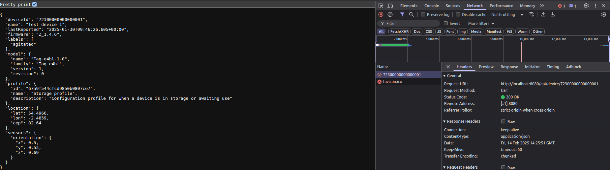

# tech-test-java-main
tech-test-java-main contains a System Loco _LocoAware_ server that exposes two API endpoints that users to GET a list of devices sorted by last_reported_time in descending order or a device by id.

## Table of Contents
- [Requirements](#requirements)
- [Build](#Build)
- [Test](#test)
- [Run](#run)

## Requirements
Note: This project uses Gradle wrapper to build it so you don't need to install Gradle on your machine to build/test and run the application

- [Java JDK](https://www.oracle.com/java/technologies/downloads/?er=221886) version 17 or higher
- [Git](https://git-scm.com/downloads)

## Build

To build the server, you can execute:

`./gradlew build`

This command will build the server to the build directory.

Expected output:
```
BUILD SUCCESSFUL in 13s
10 actionable tasks: 10 up-to-date
```

## Test
To run the tests, you can execute:

`./gradlew test`

Expected output:
```
BUILD SUCCESSFUL in 3s
7 actionable tasks: 7 up-to-date
```

This command will run all the unit tests defined in the project and tell you were you can find the failed test report.

## Run
To run the server, you can execute:

`./gradlew bootRun`

Expected output:
```
...
ngodb.net:27017 with max election id 7fffffff00000000000000db and max set version 33
2025-02-14T13:39:44.606Z  INFO 42898 --- [JavaTechTest] [  restartedMain] o.s.b.w.embedded.tomcat.TomcatWebServer  : Tomcat started on port 8080 (http) with context path '/'
2025-02-14T13:39:44.649Z  INFO 42898 --- [JavaTechTest] [  restartedMain] c.s.techtest.JavaTechTest.Application    : Started Application in 18.761 seconds (process running for 20.707)
....
```

The API can be viewed in the browser. Below is a screenshot of sending a GET rquest to the GetDevice endpoint.

